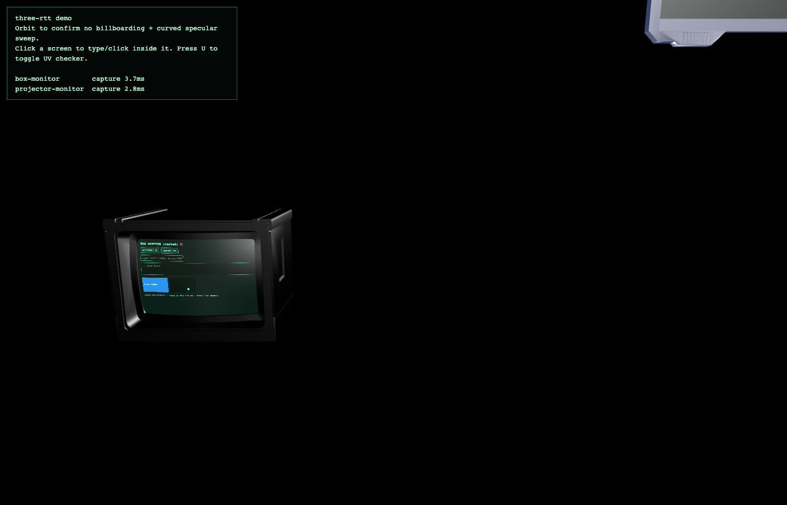

# three-rtt

**Render-to-texture for live, interactive web content on Three.js meshes.**

Put a real web app — DOM, CSS animations, `<video>`, nested `<canvas>` — onto any mesh in a
Three.js scene, curved or flat, with no `<iframe>`, no camera-facing overlay, and full
click/keyboard interactivity. The content is a real, ordinary texture: it rides the mesh's own
UVs, gets normal lighting/occlusion/perspective from the WebGL pipeline, and never repositions
itself to face the camera.

[](https://www.npmjs.com/package/three-rtt)
[](./LICENSE)

<p align="center">
  
</p>

## Why this exists

The usual way to put "a screen" in a Three.js scene is one of:

- **An `<iframe>`**, positioned in 3D via `@react-three/drei`'s `<Html>` or similar. Works for
  simple cases, but it's cross-origin by nature (storage/session headaches), and it's fixed to
  a flat CSS-transformed plane — it can never conform to a curved screen mesh.
- **`<Html transform>` with in-process content** (no iframe, real DOM mounted directly). Better
  for interactivity, but it's still an affine CSS 3D transform on a flat quad composited *on
  top of* the WebGL canvas — not a real, depth-tested, lit part of the scene. It cannot curve,
  and it needs manual z-index/occlusion hacks to look attached to the model at all.
- **A frozen snapshot texture.** Solves curvature, but it's a single static image — no
  animation, no interactivity, no live content.

**three-rtt** is a fourth option: a genuine render-to-texture pipeline. It continuously
rasterizes a live, off-screen DOM subtree into a `<canvas>`, wires that canvas up as a
`THREE.CanvasTexture` on the target mesh's material, and bridges pointer/keyboard input back
into the real DOM via raycasting — so the *only* thing touching the WebGL scene is an ordinary
texture, and the *only* thing handling text input is a real, focused, native `<input>`.

## Install

```bash
npm install three-rtt
```

`three` (`>=0.160.0`) is a peer dependency — bring your own version.

## Quick start

```ts
import { ScreenSurfaceRegistry } from "three-rtt";
import { Mesh, PerspectiveCamera, WebGLRenderer } from "three";

// Any live, connected DOM subtree — a real app, not a snapshot.
const root = document.createElement("div");
root.style.cssText = "position: fixed; inset: 0; z-index: -1; width: 1024px; height: 768px;";
root.innerHTML = `<button style="font-size: 32px;">Click me</button>`;
document.body.appendChild(root);

const registry = new ScreenSurfaceRegistry();

registry.register({
  id: "monitor-1",
  mesh: screenMesh, // any THREE.Mesh — flat or curved, doesn't matter
  root,
  resolution: { width: 1024, height: 768 },
  input: { camera, domElement: renderer.domElement },
});
```

That's it — `screenMesh` now shows `root`'s live content, textured along its real geometry
(curved meshes warp correctly, with zero special-casing), and clicking/typing on the mesh in
the 3D scene reaches the real DOM inside `root`.

See [`examples/vite-demo`](./examples/vite-demo) for a complete, runnable scene: two monitors
(one curved, one flat), a live `@keyframes` animation, a `<video>`, a nested animated
`<canvas>`, and a real `<input>` — all interactive, all textured directly onto FBX-authored
meshes.

## How it works

1. **Compositor** (`DomCompositor`): rAF-throttled, dirty-gated DOM rasterizer. The base layer
   (everything except `<video>`/`<canvas>`) is serialized via SVG `foreignObject` and only
   re-rasterized when a `MutationObserver` reports a structural change — a static UI costs
   effectively nothing per frame once painted once. `<video>`/`<canvas>` descendants are
   excluded from that serialization (unreliable across browsers) and instead `drawImage()`'d
   directly onto the output canvas every tick, since neither fires DOM mutations for their own
   playback — this gives them perfect, live fidelity.
2. **Texture** (`ScreenTexture`): wraps the compositor's canvas in a `THREE.CanvasTexture` and
   assigns it to the target mesh's material. It never touches geometry or UVs — curvature
   support is free, because the GPU already interpolates the mesh's own UV attribute
   per-triangle, exactly as it would for any authored texture.
3. **Input** (`InputBridge`): raycasts the pointer against the mesh, converts the hit's UV to
   pixel coordinates in the DOM root, and does a **geometry-based hit-test** (not
   `document.elementFromPoint` — the root isn't necessarily where the OS cursor visually is) to
   find the real element underneath. Dispatches a synthetic `PointerEvent`/`WheelEvent` there,
   and on a focusable/editable target, calls a **real** `element.focus()`. Because the DOM root
   is genuinely connected and laid out, that real focus call means native keyboard, IME
   composition, and text selection all keep working with **zero further synthesis**.
4. **Registry** (`ScreenSurfaceRegistry`): tracks N independent screens and shares one rAF loop
   across all of their compositors, instead of each running its own.

## API

| Export | What it's for |
|---|---|
| `ScreenSurface` | Facade tying one mesh to one live DOM root: compositor + texture + input, one object. Prefer this (or the registry) over the pieces below unless you need finer control. |
| `ScreenSurfaceRegistry` | Register/unregister N screens; shares one rAF loop; `worldTransformsSnapshot()` gives an app raw material for multi-monitor layout policy (ordering, a spanned desktop, focus-follows-click) — no such policy is baked in here. |
| `DomCompositor` | The rasterizer on its own, if you want to drive the canvas yourself. |
| `ScreenTexture` | The `CanvasTexture` ↔ mesh material wiring on its own. |
| `InputBridge` | The raycast → hit-test → dispatch bridge on its own. |
| `ForeignObjectRasterStrategy` | The default rasterization strategy; implement `RasterStrategy` to swap in another (e.g. `html2canvas`, or a native offscreen-webview capture for an Electron/Tauri desktop shell). |

Full signatures are in [`src/index.ts`](./src/index.ts) and the shipped `.d.ts`.

### `ScreenSurface` / `ScreenSurfaceRegistry.register()` options

```ts
interface ScreenSurfaceOptions {
  id: string;
  mesh: THREE.Mesh;
  root: HTMLElement;                 // live, connected, laid-out DOM subtree
  resolution: { width: number; height: number };
  compositor?: {
    fps?: number;                    // default 24; the focused/active screen can go up to 60
    dirty?: "always" | "mutation-observer" | (() => boolean);
    strategy?: RasterStrategy;
  };
  texture?: {
    applyAsEmissive?: boolean;       // self-lit "glowing screen" look
    materialFactory?: (original: THREE.Material) => THREE.Material;
    colorSpace?: THREE.ColorSpace;
    generateMipmaps?: boolean;       // default false: crisp text over blurred mipmaps
  };
  input?: {
    camera: THREE.Camera;
    domElement: HTMLElement;         // usually renderer.domElement
    keyboardMode?: "focus-transfer" | "synthetic"; // default "focus-transfer"
  } | false;                         // false: render-only, no input forwarding
}
```

## Performance

The two costs involved are very different in kind, and the design keeps them separate on
purpose:

- **Cheap, every tick regardless of fps**: `drawImage()` for live `<video>`/`<canvas>`
  descendants, and `texture.needsUpdate = true`. Unremarkable on any GPU from the last decade.
- **Comparatively expensive, only when actually dirty**: the SVG-`foreignObject` base-layer
  serialize → decode → draw. Gated behind `MutationObserver` by default, so a static UI with an
  idle window costs nothing once painted.

Recommended tiering (all configurable, none hardcoded): the focused/actively-used screen up to
60fps; background-but-visible screens 15–24fps; off-frustum screens frozen entirely via
`ScreenSurface.setDetail("frozen")`. If a capture hasn't resolved before the next tick is due,
that tick is skipped rather than queued, so a loaded machine degrades to a lower *effective* fps
smoothly instead of backing up.

## Known limitations

- **Native CSS `:hover`** needs genuine cursor position, not `dispatchEvent()` — hover-only
  styling won't trigger by default. The compositor tags the current geometric hit target with a
  `data-hover` attribute each tick, so a consuming app can add companion `[data-hover]` CSS
  rules if it cares.
- **Hit-testing is a geometry-based approximation**, not a full CSS stacking-context resolver:
  explicit `z-index` wins ties, then smallest-area (most specific) element, then document order.
  Correct for the overwhelming majority of real UIs; may misfire on deliberately exotic stacking.
- **`<video>`/`<canvas>` clipping** to their nearest `overflow: hidden` ancestor is a rectangle
  intersection — exact `clip-path`/`border-radius` clipping isn't applied.
- Base-layer rasterization is SVG-`foreignObject`-based, which has known cross-browser quirks
  for very exotic CSS. The `RasterStrategy` interface exists specifically so a different backend
  can be swapped in without touching the texture or input layers.

## Demo

```bash
git clone https://github.com/AnotherJulia/three-rtt.git
cd three-rtt
npm install
npm run build
cd examples/vite-demo
npm run dev      # or, if your npm has workspace-related quirks: ../../node_modules/.bin/vite
```

Open the printed local URL. Orbit to confirm no billboarding and a specular sweep across the
curved monitor; click a screen to type/click into it; press `U` to toggle a UV-checker pattern
on both screens.

The two FBX models under `examples/vite-demo/public/models/` are included solely to
demonstrate the library against real curved/flat authored geometry — they aren't covered by
the MIT license below.

## License

MIT for the library source. See the note above regarding the demo's bundled 3D models.
